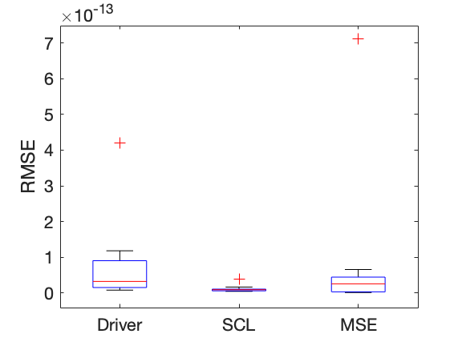
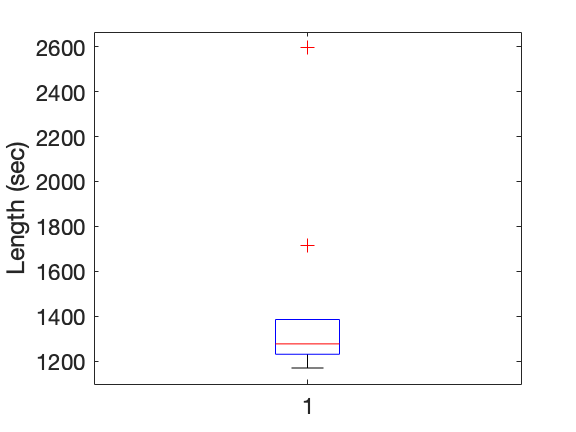

# SparsEDA-python

This code is translated from the folliwng github page:
https://github.com/fhernandogallego/sparsEDA

Following figure shows the performance compared to the original code written for Matlab (five females and five males).

If you use this code, please cite these for your literature works:
1. Hernando-Gallego, Francisco, David Luengo, and Antonio Artés-Rodríguez. "Feature extraction of galvanic skin responses by nonnegative sparse deconvolution." IEEE journal of biomedical and health informatics 22.5 (2017): 1385-1394.
2. https://github.com/fhernandogallego/sparsEDA
3. 
